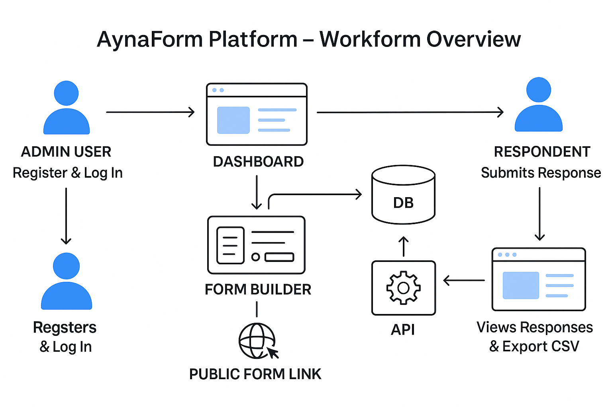

# AynaForm

AynaForm is a modern feedback and survey platform for creating, sharing, and analyzing custom forms. Built with the MERN stack, it enables teams and organizations to collect structured responses, export data, and manage feedback workflows with ease.

---

## Table of Contents
- [Description](#project-title--description)
- [Tech Stack](#tech-stack)
- [Prerequisites](#prerequisites)
- [Local Setup & Running](#local-setup--running)
- [Project Structure](#project-structure)
- [Workflow Overview](#workflow-overview)
- [Architecture & Design Decisions](#architecture--design-decisions)
- [Usage](#usage)

---

## Project Title & Description
- **AynaForm**: Modern feedback and survey platform
- **Purpose**: Empower users to create forms, collect responses, analyze results, and export data for actionable insights.
- **Features:**
  - Admin registration and authentication
  - Form builder with text and multiple-choice questions
  - Public form sharing via link
  - Real-time dashboard for managing forms and responses
  - CSV export of responses
  - Dark mode and responsive UI

---

## Tech Stack
- **Frontend:** React, Tailwind CSS, Framer Motion, React Router, Axios
- **Backend:** Node.js, Express.js
- **Database:** MongoDB (local instance)
- **Authentication:** JWT (JSON Web Tokens)
- **Other Libraries/Tools:**
  - Mongoose (ODM)
  - Joi (validation)
  - Morgan, CORS, dotenv
  - React Hot Toast, recharts

---

## Prerequisites
- **Node.js:** v18+ recommended
- **npm:** v9+ (comes with Node.js)
- **MongoDB:** Local MongoDB instance running on default port (`mongodb://localhost:27017`)
- **CLI Tools:**
  - `git` for cloning the repository

---

## Local Setup & Running

### 1. Clone the Repository
```bash
git clone https://github.com/your-org/AynaForm.git
cd AynaForm
```

### 2. Install Dependencies
#### Backend
```bash
cd backend
npm install
```
#### Frontend
```bash
cd ../frontend
npm install
```

### 3. Environment Variables
Create a `.env` file in `backend/` with the following fields:
```env
PORT=5000
MONGO_URI=mongodb://localhost:27017/aynaform
JWT_SECRET=your_jwt_secret_here
```
> See `.env.example` for reference.

### 4. Start MongoDB
- Ensure MongoDB is running on your machine (default port 27017).

### 5. Start the Backend
```bash
cd backend
npm run dev
```

### 6. Start the Frontend
```bash
cd ../frontend
npm run dev
```
The frontend will be available at [http://localhost:5173](http://localhost:5173) by default.

### 7. Running Tests
#### Backend
```bash
cd backend
npm test
```

---

## Project Structure
```
AynaForm/
  backend/
    src/
      controllers/   # API logic (auth, forms)
      models/        # Mongoose schemas
      routes/        # Express routes
      middleware/    # Auth, error handling
      utils/         # CSV export, helpers
    tests/           # Jest/Supertest API tests
    app.js           # Express app entry
    index.js         # Simple server entry
  frontend/
    src/
      components/    # Navbar, UI elements
      pages/         # App, Dashboard, FormBuilder, etc.
      hooks/         # Custom React hooks
      services/      # API calls
      styles/        # Tailwind CSS
    public/          # Static assets
    index.html       # Main HTML
  scripts/           # Utility scripts (e.g., exportCSV.sh)
  README.md
```

---

## Workflow Overview



---

## Architecture & Design Decisions
- **MERN Stack:**
  - Chosen for rapid development, scalability, and a unified JavaScript codebase.
- **JWT Authentication:**
  - Stateless, secure authentication for admin users.
  - Tokens stored in localStorage; middleware protects API routes.
- **Question/Response Data Modeling:**
  - Each question and response uses stable MongoDB ObjectIDs.
  - Enables robust mapping between questions and answers, even after edits.
- **Handling Question Reordering & Data Integrity:**
  - Questions have persistent IDs; reordering or editing questions does not break response mapping.
  - When a question is deleted, related answers are purged from all responses to maintain integrity.

---

## Usage
### 1. Register as Admin & Create a Form
- Visit `/register` to create an admin account.
- Log in and access the dashboard.
- Click "New Form" to launch the form builder.
- Add questions (text or multiple choice), set required fields, and save.

### 2. Share a Form Link & Submit Responses
- Copy the public form link from the form details page.
- Share the link with users; anyone can submit responses (no login required).

### 3. View Dashboard & Export CSV
- Dashboard lists all your forms and their stats.
- Click a form to view, edit, or manage responses.
- Export all responses as CSV for analysis or reporting.

---

For questions or contributions, please open an issue or pull request.